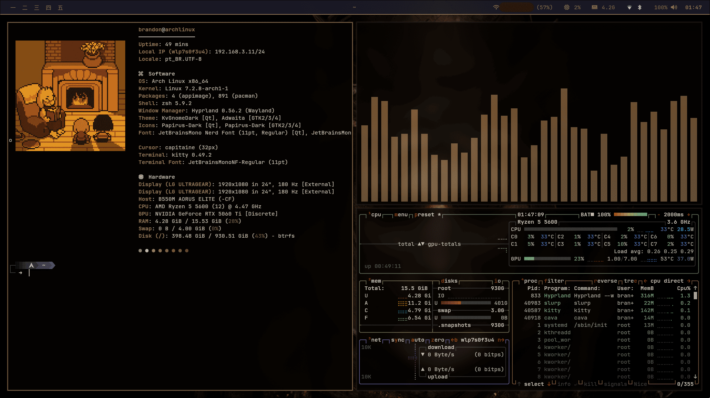
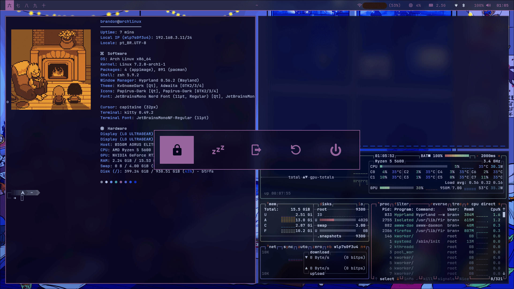
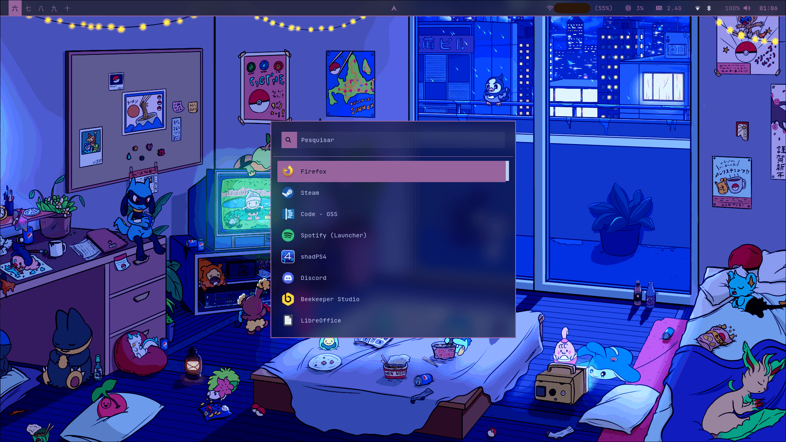
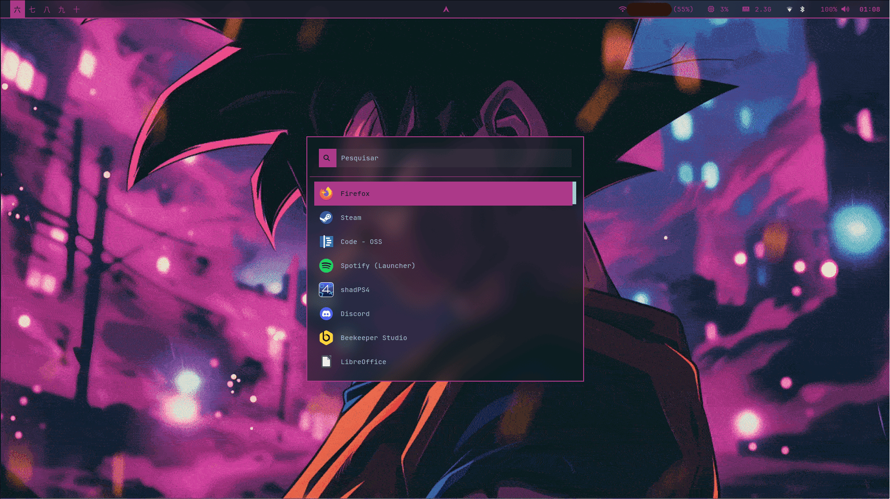
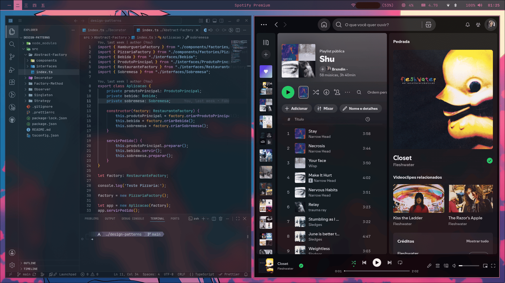

# Arch + Hyprland

Dotfiles de customizações para o sistema operacional Arch Linux usando como base o Hyprland e outros pacotes.
O repositório serve principalmente para manter atualizado o sistema que eu uso diariamente, então ainda não tem um tutorial de instalação. Mas, se você sabe mexer com isso, aproveite o que precisar.

## Conteúdo

A interface criada busca juntar leveza, praticidade e estética. Ela funciona baseada, principalmente, em atalhos de teclado, o que dá certa velocidade mas exige uso diário para se acostumar. Apesar de não terem menus dedicados a isso, o foco é a customização e estética, então da pra mudar praticamente tudo, isso é só um formato opinativo e que eu uso no dia a dia.

Os principais pacotes usados para a customização foram:

- Core: Hyprland, Waybar, Rofi, SDDM.
- Terminal e Shell: Kitty, Zsh, Fastfetch, Starship.
- Aparência e Utilitários: Mako, Thunar, awww e Pywal.

Além disso, foram feitos diversos scripts em Shell para automatizar algumas tarefas como, por exemplo:

- Wallpaper: troca de wallpapers e cores dinâmicas das ferramentas e janelas dos aplicativos baseadas em sua paleta de cores.
- Notificações: atualizações disponíveis pro sistema ao iniciar, música atual do Spotify
- Screenshot: script para automatizar a chamada das ferramentas, a nomeclatura e o salvamento de screenshots
- Game Mode: opção de desativar certos efeitos e consumir menos recursos da placa de vídeo enquanto estiver em jogo (ou em qualquer outro momento)
- System Lock: wallpapers aleatórios no lock do sistema.

## Exemplos

Algumas imagens de exemplo com os efeitos do sistema e dinâmica de cores e wallpapers com os aplicativos:

## Observações

- A estilização foi baseada no Glassmorphism.
- Essa customização evita o uso de pacotes do AUR por questões de segurança e compatibilidade maior.
- Em alguns arquivos do GitHub os ícones/caracteres podem parecer bugados pois estou usando a fonte JetBrainsMono Nerd.
- Usei `archinstall` com NetworkManager, btrfs, systemd-boot e type Minimal (então a maioria das coisas teve que ser baixada manualmente).
- A maior parte das configurações foi feita pesquisando e usando o Gemini, mas alguns atalhos, pacotes, funcionalidades e a escolha do estilo foram pessoais.
- Algumas configurações e pacotes específicos foram usados por conta da minha GPU ser uma Nvidia RTX. O Hyprland não lida tão bem com os drivers, então são necessárias algumas configurações manuais específicas e alguns pacotes a mais para melhorar o funcionamento.
